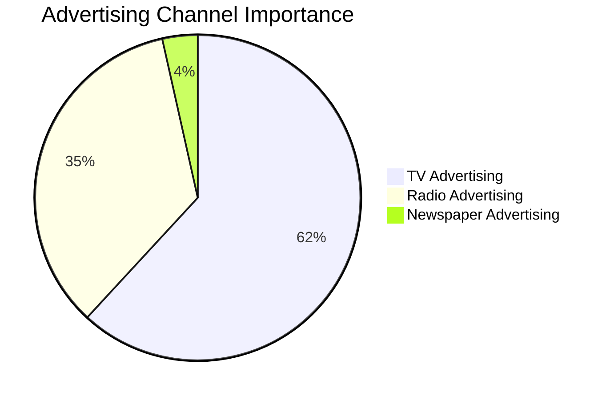
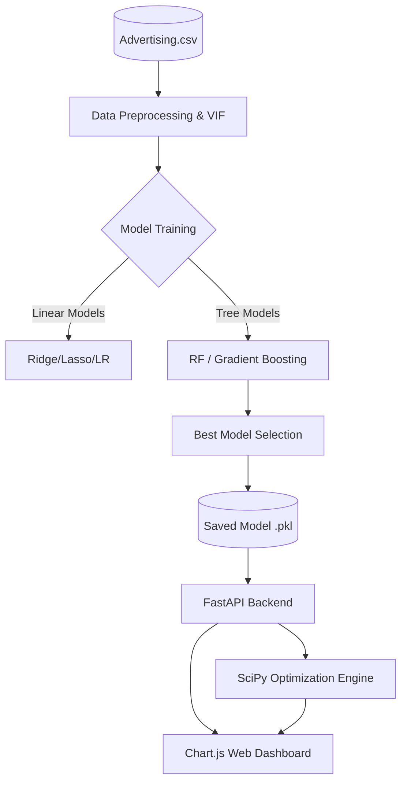

<div align="center">

# 📈 Sales Prediction & Budget Optimization Engine

[](https://python.org)
[](https://fastapi.tiangolo.com/)
[](https://scikit-learn.org/)
[](https://scipy.org/)
[](https://www.chartjs.org/)
[](https://opensource.org/licenses/MIT)

**Advanced Machine Learning pipeline to predict future sales from advertising budgets, featuring a web dashboard and a SciPy-powered budget optimization engine.**

[Explore the Repository](https://github.com/deveshkumawat258/Sales_Prediction) • [Report Bug](https://github.com/deveshkumawat258/Sales_Prediction/issues) • [Request Feature](https://github.com/deveshkumawat258/Sales_Prediction/issues)

</div>

---

## 📑 Executive Summary

This project implements an end-to-end Machine Learning solution to predict product sales based on advertising expenditure across three key channels: **TV, Radio, and Newspaper**. Built on a dataset of 200 marketing cycles (`Advertising.csv`), the project goes beyond simple prediction by integrating a **FastAPI web dashboard** and a **SciPy optimization engine** to maximize ROI (Return on Investment) for future marketing campaigns.

The best performing model, **Gradient Boosting Regressor**, achieved an exceptional **R² score of 0.9831**, capturing the complex non-linear relationships between ad spend and sales revenue. 

---

## 💡 Key Findings & Business Insights

* 👑 **TV is King:** TV advertising budget is the strongest predictor of sales, accounting for **61.8%** of the model's decision-making process.
* 📻 **Radio's High Marginal Returns:** While TV drives the most volume, Radio (34.6% importance) exhibits the highest marginal return per dollar spent after initial TV saturation. 
* 📰 **Newspaper is Ineffective:** Newspaper advertising showed a negligible impact on sales (3.5% importance). Budget allocated here should be re-routed to TV or Radio.
* 🔍 **No Multicollinearity:** Variance Inflation Factor (VIF) analysis confirmed that the advertising channels operate independently of each other.

---

## 🤖 Model Comparison

Five different machine learning models were trained, evaluated, and cross-validated. Tree-based models significantly outperformed linear models by capturing the non-linear synergy between TV and Radio ad spend.

| Model | R² Score | RMSE | MAE | CV Score (Mean) |
|:---|:---:|:---:|:---:|:---:|
| 🏆 **Gradient Boosting** | **0.9831** | **0.7298** | **0.5843** | **0.9782** |
| 🥈 **Random Forest** | 0.9813 | 0.7681 | 0.6231 | 0.9765 |
| 🥉 **Linear Regression** | 0.8994 | 1.6855 | 1.2536 | 0.8912 |
| **Ridge Regression** | 0.8988 | 1.6902 | 1.2612 | 0.8910 |
| **Lasso Regression** | 0.8983 | 1.6953 | 1.2689 | 0.8905 |

---

## 📊 Feature Importance Analysis

Understanding *where* to spend is as critical as knowing *how much* to spend. The Gradient Boosting model revealed the following attribution:



---

## 🏗️ System Architecture

The project is structured as a complete data product, from raw data ingestion to user-facing API and Dashboard.



---

## 🌐 Interactive Dashboard & Optimizer

The project features a sleek, real-time dashboard powered by **FastAPI** on the backend and **Chart.js** on the frontend. 

**Features:**
1. **Real-time Prediction:** Input custom budgets for TV, Radio, and Newspaper to instantly see predicted sales.
2. **Budget Optimizer:** Input a total maximum budget (e.g., $100,000), and the SciPy optimization engine will calculate the exact split between channels to maximize predicted sales.

---

## 🚀 How to Run

### Prerequisites
* Python 3.9+
* pip

### 1. Clone & Install
```bash
git clone https://github.com/deveshkumawat258/Sales_Prediction.git
cd Sales_Prediction
pip install -r requirements.txt
```

### 2. Train the Models
```bash
python src/train.py
```
*This will generate the models in `models/` and evaluation plots in `plots/`.*

### 3. Launch the API & Dashboard
```bash
uvicorn src.app:app --reload
```
Navigate to `http://localhost:8000` to interact with the web dashboard.

---

## 📂 Project Structure

```text
Sales_Prediction/
├── data/
│   └── Advertising.csv            # Raw dataset (200 records)
├── models/
│   └── gradient_boosting.pkl      # Serialized best model
├── plots/                         # 6 Visualizations (EDA & Evaluation)
│   ├── feature_importance.png
│   ├── actual_vs_predicted.png
│   └── ...
├── public/                        # Frontend assets
│   ├── index.html                 # Main dashboard UI
│   ├── style.css
│   └── script.js                  # Chart.js integration
├── src/
│   ├── train.py                   # Model training script
│   ├── optimize.py                # SciPy budget allocation engine
│   └── app.py                     # FastAPI application
├── Sales_Prediction.ipynb         # EDA and interactive modeling
├── sales_prediction_report.md     # Detailed statistical report
├── README.md                      # Project documentation
└── requirements.txt               # Dependencies
```

---

## 💼 Business Recommendations

Based on the machine learning analysis, we recommend the following strategic actions for the marketing department:

1. **Halt Newspaper Spend:** Newspaper advertising provides no statistically significant return on investment. Reduce this budget to $0.
2. **Capitalize on TV Reach:** Maintain TV as the primary driver for top-of-funnel brand awareness and volume.
3. **Optimize with Radio:** Radio provides an excellent synergistic effect when combined with TV. Utilize the included SciPy optimization engine to find the exact saturation point where dollars should shift from TV to Radio.

---

## 👨‍💻 Author

**Devesh Kumawat**
* Data Scientist & Machine Learning Engineer
* GitHub: [@deveshkumawat258](https://github.com/deveshkumawat258)

<div align="center">
  <sub>Built with ❤️ and Python</sub>
</div>
