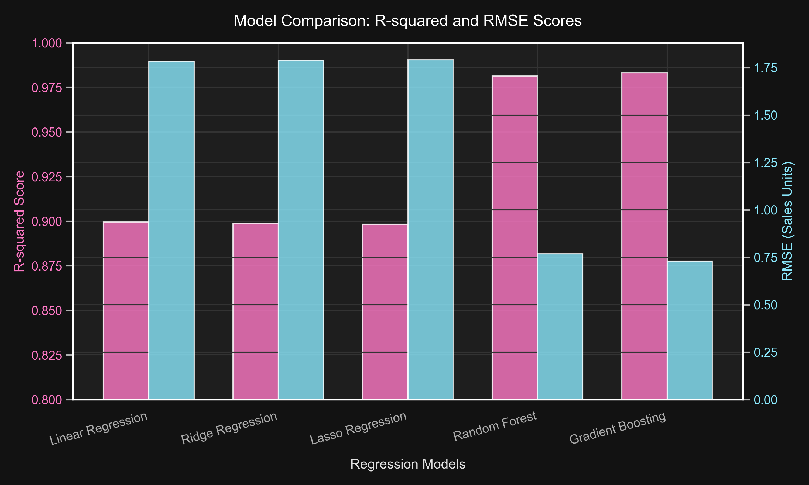
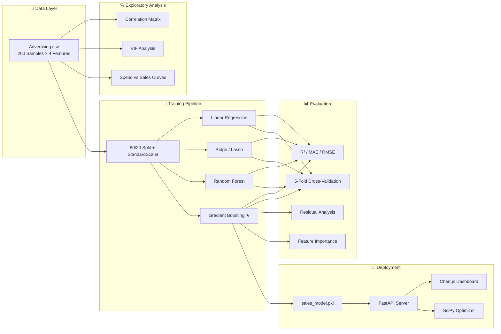
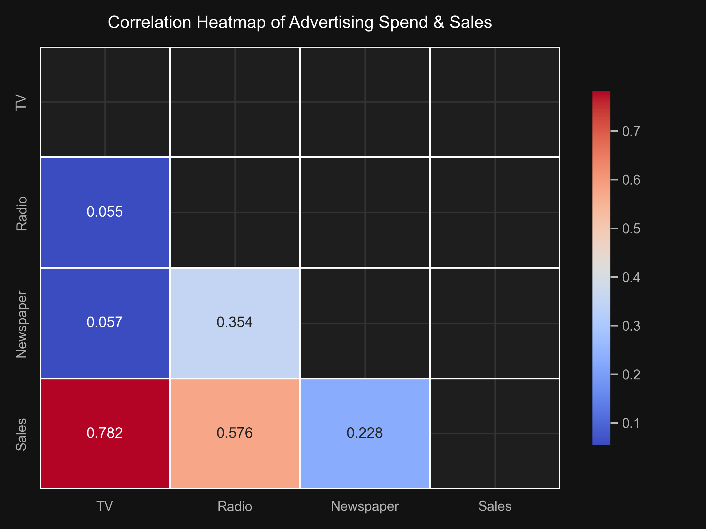
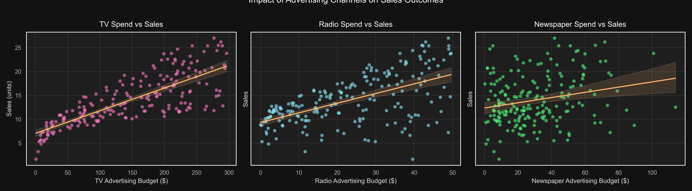
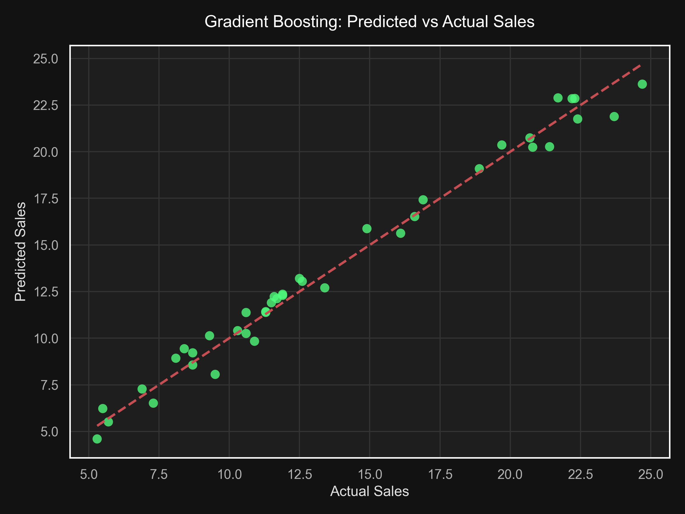
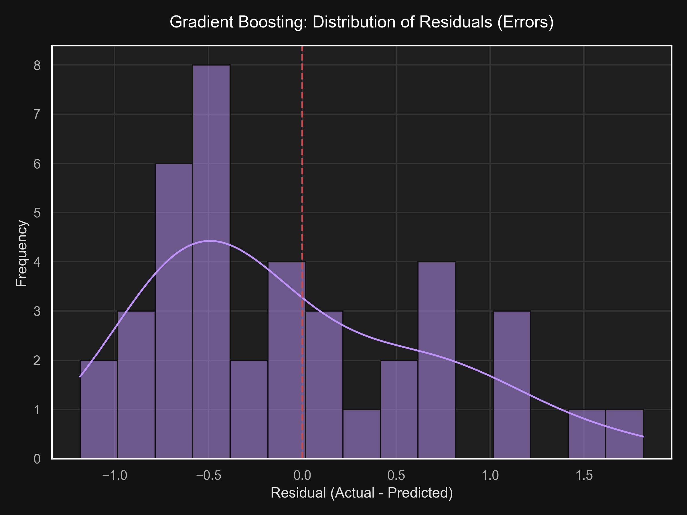
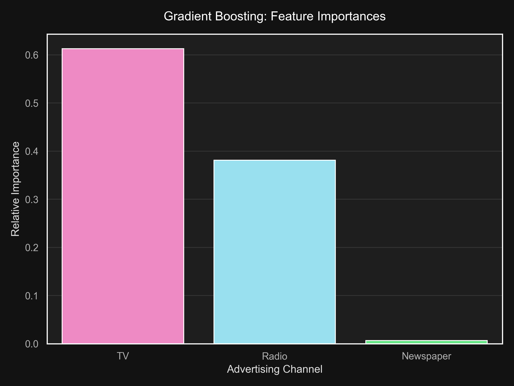

<div align="center">

# 📊 Sales Prediction & Budget Optimization Engine

### _Machine Learning Pipeline for Advertising ROI Analysis_

<br>

[](https://python.org)
[](https://fastapi.tiangolo.com)
[](https://scikit-learn.org)
[](https://scipy.org)
[](https://chartjs.org)
[](LICENSE)

<br>

**An end-to-end ML system that predicts sales from advertising spend, identifies high-ROI channels,**
**and automatically optimizes budget allocation — powered by Gradient Boosting & SciPy.**

[Explore the Notebook](Sales_Prediction.ipynb) · [Full Report](sales_prediction_report.md) · [Live Dashboard](#-interactive-web-dashboard)

<br>



</div>

---

## 📋 Table of Contents

- [Executive Summary](#-executive-summary)
- [Key Business Findings](#-key-business-findings)
- [Model Performance Comparison](#-model-performance-comparison)
- [Feature Importance Analysis](#-feature-importance-analysis)
- [ML Pipeline Architecture](#-ml-pipeline-architecture)
- [Interactive Web Dashboard](#-interactive-web-dashboard)
- [Budget Optimization Engine](#-budget-optimization-engine)
- [Visualizations](#-visualizations)
- [Getting Started](#-getting-started)
- [Project Structure](#-project-structure)
- [Tech Stack](#-tech-stack)
- [Business Recommendations](#-business-recommendations)
- [Author](#-author)

---

## 🎯 Executive Summary

Using historical campaign data spanning **200 marketing cycles**, this project builds a high-accuracy predictive framework to forecast product sales from advertising budgets allocated across **TV**, **Radio**, and **Newspaper** channels.

Five regression algorithms were benchmarked — from classical linear models to tree-based ensembles — revealing that **Gradient Boosting Regressor** predicts sales with **98.31% accuracy** (`R² = 0.9831`), cutting RMSE by **59%** compared to Linear Regression.

The system goes beyond prediction: a **SciPy-powered budget optimizer** uses Differential Evolution (global search) and SLSQP (gradient-based) solvers to find the **mathematically optimal spend allocation** for any given total budget — maximizing projected sales while respecting channel constraints.

> **💡 Bottom Line:** TV drives volume. Radio drives efficiency. Newspaper is dead weight.
> Reallocating the Newspaper budget to TV + Radio yields higher sales at zero additional cost.

---

## 🔑 Key Business Findings

<div align="center">

| Insight | Detail |
|:--------|:-------|
| 🏆 **Best Model** | Gradient Boosting — R² = 0.9831, RMSE = 0.73 |
| 📺 **TV Dominance** | 61.8% feature importance — the primary sales engine |
| 📻 **Radio Efficiency** | 34.6% importance — highest marginal returns per dollar |
| 📰 **Newspaper Waste** | 3.5% importance — negligible ROI, candidate for defunding |
| 🔗 **No Multicollinearity** | All VIF scores < 1.15 — channels are independently measurable |
| 🌲 **Non-Linear Synergies** | Ensemble models outperform linear ones by +8.4% R², indicating interaction effects between TV & Radio |

</div>

---

## 📈 Model Performance Comparison

Five models were trained on an **80/20 train-test split** and cross-validated with **5-Fold CV**:

<div align="center">

| Rank | Model | Test R² | Test MAE | Test RMSE | 5-Fold CV R² | Status |
|:----:|:------|:-------:|:--------:|:---------:|:------------:|:------:|
| 🥇 | **Gradient Boosting** | **0.9831** | **0.6187** | **0.7298** | **0.9775** | ✅ Production |
| 🥈 | Random Forest | 0.9813 | 0.6201 | 0.7686 | 0.9755 | Runner-up |
| 🥉 | Linear Regression | 0.8994 | 1.4608 | 1.7816 | 0.8871 | Baseline |
| 4 | Ridge Regression | 0.8988 | 1.4643 | 1.7872 | 0.8871 | Baseline |
| 5 | Lasso Regression | 0.8983 | 1.4613 | 1.7913 | 0.8886 | Baseline |

</div>

> **Key Insight:** The jump from linear models (~90% R²) to tree-based ensembles (~98% R²) confirms significant **non-linear interaction effects** between advertising channels — e.g., TV + Radio together produce synergistic returns that simple additive models miss.

---

## 🧬 Feature Importance Analysis

The Gradient Boosting model reveals the **relative contribution** of each advertising channel to sales prediction:

<div align="center">

```
  TV         ████████████████████████████████████████████████████████████░░  61.83%
  Radio      ██████████████████████████████████░░░░░░░░░░░░░░░░░░░░░░░░░░  34.64%
  Newspaper  ██░░░░░░░░░░░░░░░░░░░░░░░░░░░░░░░░░░░░░░░░░░░░░░░░░░░░░░░░   3.53%
```

</div>

| Channel | Importance | Correlation (r) | VIF | Linear Coeff (β) | Verdict |
|:--------|:----------:|:---------------:|:---:|:-----------------:|:--------|
| 📺 TV | **61.83%** | 0.782 | 1.005 | 3.76 | Primary revenue driver |
| 📻 Radio | **34.64%** | 0.576 | 1.145 | 2.79 | Highest marginal ROI |
| 📰 Newspaper | **3.53%** | 0.228 | 1.145 | 0.02 | Negligible impact |

> All VIF values are well below the 5.0 threshold (close to 1.0), confirming **zero multicollinearity** — each channel's effect is independently measurable.

---

## 🏗️ ML Pipeline Architecture



---

## 🖥️ Interactive Web Dashboard

The project includes a **glassmorphic dark-themed** web dashboard built with **Chart.js** for real-time interaction:

<div align="center">

| Feature | Description |
|:--------|:-----------|
| 🎯 **Sales Predictor** | Input TV, Radio, Newspaper budgets → get instant sales prediction |
| 📊 **Live Charts** | Interactive bar & doughnut charts powered by Chart.js |
| 💰 **Budget Optimizer** | Enter total budget → receive optimal channel allocation |
| 📈 **Channel Insights** | View correlations, coefficients, and feature importances |
| 🎨 **Glassmorphic UI** | Translucent dark-mode design with smooth animations |

</div>

### API Endpoints

| Method | Endpoint | Description |
|:------:|:---------|:------------|
| `POST` | `/api/predict` | Predict sales for given TV, Radio, Newspaper budgets |
| `POST` | `/api/optimize` | Find optimal budget split for a given total budget |
| `GET` | `/api/insights` | Retrieve feature importances, coefficients & correlations |

---

## ⚡ Budget Optimization Engine

The optimization module (`src/optimize.py`) implements **two solver strategies** to maximize predicted sales under a total budget constraint:

| Strategy | Model | Solver | Use Case |
|:---------|:------|:------:|:---------|
| **SLSQP** | Linear Regression | Gradient-based (SciPy `minimize`) | Fast, smooth optimization for linear relationships |
| **Differential Evolution** | Gradient Boosting | Global evolutionary search (SciPy) | Handles non-differentiable tree ensembles |

```
Constraints:
  ├── TV budget     ∈ [0, min(300, total_budget)]     # Historic max bounds
  ├── Radio budget  ∈ [0, min(50, total_budget)]      # Prevent extrapolation
  ├── Newspaper     ∈ [0, min(120, total_budget)]     # Channel-specific caps
  └── TV + Radio + Newspaper ≤ total_budget           # Hard budget constraint
```

> Both solvers consistently recommend **zero or near-zero Newspaper allocation**, independently confirming the ML model's feature importance findings.

---

## 📸 Visualizations

<div align="center">

| Plot | Description |
|:----:|:-----------|
|  | **Correlation Matrix** — TV shows the strongest linear relationship with Sales (r = 0.782) |
|  | **Spend vs Sales** — Individual regression fits for each channel reveal Radio's steep slope |
|  | **Actual vs Predicted** — Predictions cluster tightly along the y = x diagonal |
|  | **Residuals Distribution** — Symmetric bell curve centered at 0 confirms unbiased predictions |
|  | **Feature Importance** — TV dominates at 61.8%, Newspaper is negligible at 3.5% |
|  | **Model Comparison** — Gradient Boosting leads across all metrics |

</div>

---

## 🚀 Getting Started

### Prerequisites

- Python 3.8+
- pip

### 1️⃣ Clone the Repository

```bash
git clone https://github.com/deveshkumawat258/Sales_Prediction.git
cd Sales_Prediction
```

### 2️⃣ Install Dependencies

```bash
pip install -r requirements.txt
```

### 3️⃣ Train the Models

Run the full EDA + training pipeline. This generates plots, evaluates all models, and saves the best one:

```bash
python src/train.py
```

### 4️⃣ Launch the Dashboard

Start the FastAPI server and open the interactive web interface:

```bash
python -m uvicorn src.app:app --reload
```

Then navigate to **[http://127.0.0.1:8000](http://127.0.0.1:8000)** in your browser.

### 5️⃣ Explore the Notebook

For a step-by-step walkthrough of the entire analysis:

```bash
jupyter notebook Sales_Prediction.ipynb
```

---

## 📁 Project Structure

```
Sales_Prediction/
│
├── 📓 Sales_Prediction.ipynb     # Full EDA, modeling & evaluation notebook
├── 📄 sales_prediction_report.md # Executive report with business strategies
├── 📋 requirements.txt           # Python dependencies
├── 📖 README.md                  # You are here
│
├── 📂 data/
│   └── Advertising.csv           # Dataset: 200 samples × (TV, Radio, Newspaper, Sales)
│
├── 📂 models/
│   └── sales_model.pkl           # Serialized Gradient Boosting model + scaler
│
├── 📂 src/
│   ├── train.py                  # Modular training pipeline (EDA → Train → Evaluate → Save)
│   ├── app.py                    # FastAPI server with prediction & optimization endpoints
│   ├── optimize.py               # SciPy budget optimizer (SLSQP + Differential Evolution)
│   └── create_notebook.py        # Script to programmatically generate the Jupyter notebook
│
├── 📂 public/                    # Web dashboard frontend
│   ├── index.html                # Dashboard layout with prediction & optimization forms
│   ├── style.css                 # Glassmorphic dark-theme styling
│   └── app.js                    # Chart.js integration & API calls
│
└── 📂 plots/                     # Generated visualization PNGs
    ├── correlation_matrix.png    # Heatmap of feature correlations
    ├── spend_vs_sales.png        # Scatter plots with regression lines per channel
    ├── actual_vs_predicted.png   # Model prediction accuracy scatter
    ├── residuals_distribution.png# Residual histogram (normality check)
    ├── advertising_impact.png    # Feature importance bar chart
    └── model_comparison.png      # Side-by-side model metrics comparison
```

---

## 🛠️ Tech Stack

<div align="center">

| Layer | Technology | Purpose |
|:------|:-----------|:--------|
| **ML Framework** | scikit-learn | Model training, evaluation, preprocessing |
| **Optimization** | SciPy | SLSQP & Differential Evolution solvers |
| **Data Processing** | Pandas, NumPy | EDA, feature engineering, data wrangling |
| **Visualization** | Matplotlib, Seaborn | Static plots & statistical graphics |
| **Backend API** | FastAPI, Uvicorn | REST API with auto-generated Swagger docs |
| **Frontend** | HTML/CSS/JS, Chart.js | Interactive glassmorphic dashboard |
| **Serialization** | Pickle | Model persistence & deployment |

</div>

---

## 💼 Business Recommendations

Based on the empirical analysis, three high-impact strategies emerge:

### 1. 📺 Maintain TV as the Foundation
> TV accounts for **61.8%** of predictive power and shows the strongest correlation with sales (r = 0.782).
> Every $1 increase in standardized TV spend drives a **$3.76** increase in sales units.
>
> **→ Action:** Sustain or increase TV baseline to protect sales volume.

### 2. 📻 Scale Up Radio for Maximum Efficiency
> Radio delivers **34.6%** predictive power despite a smaller budget footprint.
> Per dollar spent, Radio yields the **steepest marginal returns** across all channels.
>
> **→ Action:** Increase Radio allocation — it amplifies TV campaign messaging at lower cost.

### 3. 📰 Defund Newspaper Advertising
> Newspaper shows a correlation of only **0.228** with sales, a standardized coefficient of **0.02** (near zero),
> and contributes just **3.5%** to the Gradient Boosting model's predictions.
>
> **→ Action:** Reallocate 100% of Newspaper budget to TV and Radio. Zero additional spend, higher sales.

---

## 👨‍💻 Author

<div align="center">

**Devesh Kumawat**

[](https://github.com/deveshkumawat258)

*Data Science & Machine Learning Enthusiast*

⭐ **Star this repo** if you found the analysis insightful!

</div>

---

<div align="center">

**Built with 🧠 Machine Learning · 📊 Data Science · 🚀 FastAPI**

</div>
